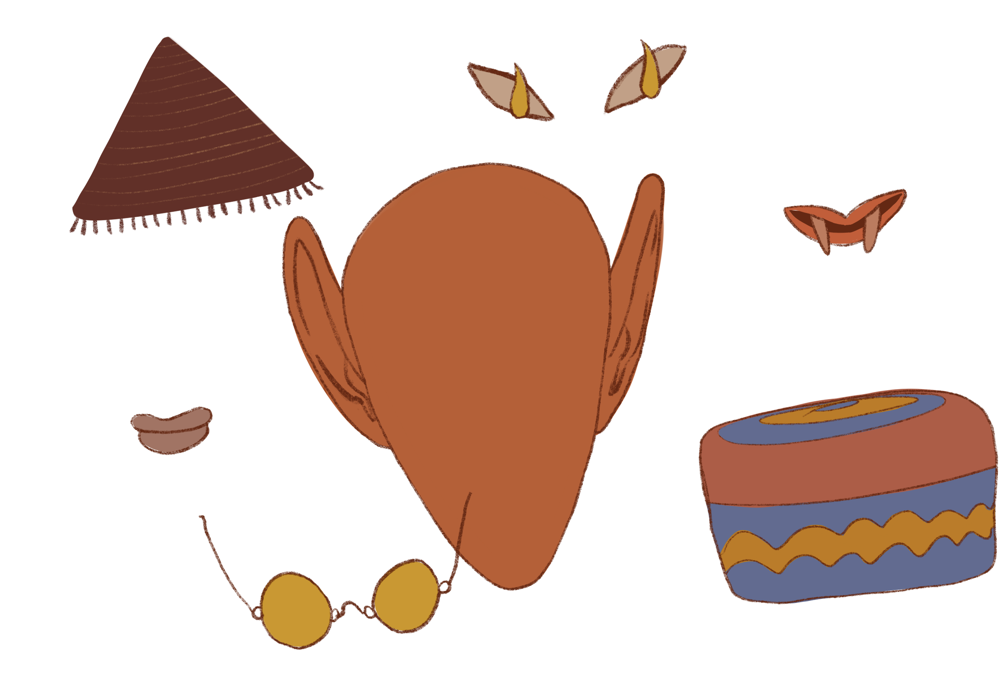
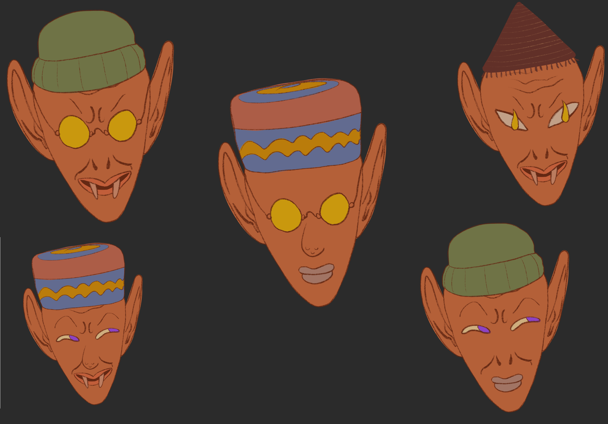

# Avatar Image Generator

## Description

This project is designed to generate avatar images using a predefined set of traits and their variants. It provides a flexible way to create unique avatars by combining different traits.

## Technical Description
The Avatar Image Generator project follows a hexagonal architecture, which emphasizes modularity and separation of concerns. It is designed to be maintainable.
Unit, integration, and architectural tests have been implemented to ensure the reliability of the codebase. These tests could be run by build.sh script.
A Git hook has been provided to trigger the build, linter check and test process before pushing changes. This helps ensure that any changes pushed to the repository are validated and meet the project's build requirements.

## Getting Started

Use run.sh to execute the program:
```shell
./run.sh path/to/config.json

```

Sample config:
```json
{
  "inputPath": "input",
  "outputPath": "output",
  "traits": [
    {
      "name": "first",
      "variants": ["var"]
    },
    {
      "name": "second",
      "variants": [ "var1", "var2" ]
    }
  ]
}
```

## Example



